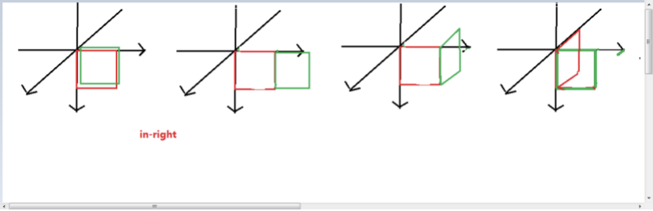

#### 1、如何实现一个自适应圆形，下列样式设置正确得是（D）;
A. width：100px;height:100px;border-radius:50px;
B. width：30%;height:30%;border-radius:50%;
C. width：30%;height:0;padding:30%;border-radius:50%;
D. width：30%;height:0;padding-top:30%;border-radius:50%;
```
D
解析:
首先题目要求为自适应圆形，那么实现一个自适应正方形，再利用border-radius:50%,即可实现自适应圆形。
自适应即当前正方形大小与当前视口大小有关，所以不能设置固定宽高A错。可以通过百分比设置宽高，
但是我们基于当前视口设置宽高百分比，问题是宽高不可能永远相等，所以百分比得宽高也不相等，
不能实现一个正方形，所以B选项不能实现。那么我们可以怎么做呢，高度的显示由设置得高度与padding值
共同撑开显示，同时padding设置百分比是基于父级宽度进行计算。无论是竖直方向还是水平方向上的padding都是
基于父级宽度的百分比计算出来，大家可以试一下。那么我们可以将高度设置成0，将padding-top或padding-bottom
设置成与宽度百分比相同的数值。注意只设置一个方向就可以了。这时高度的显示与宽度的显示百分比值基于同一个父级宽度
所以显示为正方形，再利用borer-radius:50%设置为圆.
```
 
#### 2、在设置渐变背景过程中设置_____角度创建竖直方向渐变，________创建水平方向渐变。(  B )
A. 90deg 0deg
B. 0deg 90deg
C. top to bottom
D. left to right
```
B
解析：
角度是指水平线和渐变线之间的角度，逆时针方向计算。换句话说，0deg 将创建一个从下到上的渐变，90deg 将创建一个从左到右的渐变。
```
 
#### 3、[多选] 如何去掉图片之间的默认空隙（  AD   ）。
A. font-size:0;
B. padding:0;
C. margin:0;
D. float:left;
```
A、D
解析：
图片由img标签引入 img默认为行级块元素，所有具有inline属性的元素都具有默认的间隙，所以我们可以通过设置font-size:0; 利用将字体大小设置为零，去掉空隙第二种我们可以利用浮动，浮动元素会脱离文档流，同时浮动元素排列方式为第二个浮动元素向左或向右进行浮动时排列在前一个浮动元素后，所以img标签浮动之后显示在页面上没有空隙。
```
 
#### 4、[多选] 关于渐进增强与优雅降级下列说法正确的是 （ AB   ）。
A. 渐进增强:针对低版本浏览器进行构建页面，保证最基本的功能，然后再针对高级浏览器进行处理
B. 优雅降级：一开始就构建完整的功能，然后再针对低版本浏览器进行兼容处理
C. 渐进增强:一开始就构建完整的功能，然后再针对低版本浏览器进行兼容
D. 优雅降级：针对低版本浏览器进行构建页面，保证最基本的功能，然后再针对高级浏览器进行处理
```
A、B
解析：
渐进增强：针对低版本浏览器进行构建页面，保证最基本的功能，然后再针对高级浏览器进行效果、交互等改进和追加功能达到更好的用户体验。
优雅降级：一开始就构建完整的功能，然后再针对低版本浏览器进行兼容。
```
  
#### 5、关于盒模型，下列说法错误的是(C );
A. 盒子模型有两种：IE6混杂模式盒子模型、标准W3C盒子模型；
B. IE6混杂模式的content部分包含了border和pading；
C. IE6混杂模式的content部分不包含了border和pading；
D. 可以通过box-sizing属性切换盒模型
```
C
解析：盒子模型有两种：IE6混杂模式盒子模型、标准W3C盒子模型；
IE6混杂模式的content部分包含了border和pading；
标准W3C盒模型包含：内容(content)、填充(padding)、边界(margin)、边框(border)
可以通过css3中的box-sizing属性进行切换盒模型
```
 
#### 6、描述一下伪类与伪元素的区别？
```
伪类的操作对象是文档树中已有的元素；而伪元素则是创建的文档树外的元素。
```
```
伪类本质上是为了弥补常规CSS选择器的不足，以便获取到更多信息；
伪元素本质上是创建了一个有内容的虚拟容器；
CSS3中伪类和伪元素的语法不同；
可以同时使用多个伪类，而只能同时使用一个方向的伪元素；
```
 
#### 7、实现一个上三角形。
```
div{
  width:0;
  height:0;
  border: 20px solid transparent;
  border-bottom:20px solid #f40;
}
```
 
#### 8、除了rgb在css3中还可以使用hsl来设置颜色，hsl分别代表什么含义，h() s() l()？
```
H代表色相S代表饱和度L代表亮度
```

```
解析：hsl分别代表色相 饱和度 明暗度，第一个参数为当前颜色值，第二个参数和第三个参数为百分比
```
 
#### 9、实现文字溢出打点
```
div{
  white-space:nowrap;
  overflow:hidden;
  text-overflow:ellipsis;
}
}
```
 
#### 10、利用简易css代码实现以下图形变换


    
上图html结构如下：
```
<div class="box">
  <div class="red"></div>
  <div class="green"></div>
</div>
```
答：
```


.in-right .green {
  transform-origin: 0% 0%;
  transform: translate3d(100%, 0, 0) rotate3d(0, 1, 0, 90deg);
}

.in-right .box {
	animation-name: in-right;
  animation-play-state: running;
}

@keyframes in-right {
  from {
  	transform: rotate3d(0, 0, 0, 0deg);
  }
  to {
  	transform: rotate3d(0, -1, 0, 90deg);
  }
}
```

 
#### 11、class名为box的div为class名为wrapper的子级，wrapper的宽为100px,现在为box设置css样式width:calc(50% - 10px);最终box样式为多少(40px)
```
calc是css3中计算方法，先将box宽度设置为父级宽度的百分之五十为50px,再进行减法操作，最终宽度为40px;
```
 
#### 12、列举三个css3中新增的选择器。
```
first-of-type
last-of-type
nth-of-type
```

```
element1~element2: 选择前面有element1元素的每个element2元素。
E:checked: 选择每个被选中的E元素。
E:nth-child(n): 选择属于其父元素的第n个子元素的每个E元素。等等
```
 
#### 13、一个元素先进行沿着y轴平移再绕着z轴旋转和先绕着z轴旋转再沿着y轴平移，最后的位置显示相同嘛？
```
不相同
```

#### 14、display:none、visibility:hidden:、opacity:0之间的区别
```
display:none将元素的显示设为无，即在网页中不占任何的位置。
visibility:hidden:将元素隐藏，但是在网页中该占的位置还是占着
opacity:0 人眼不可见，但浏览器可见，仍存在点击事件
```
```
display: none 彻底消失，render tree中也不存在（dom tree中存在）；可能会引起reflow
visibility: hidden 渲染为空盒子，在render tree中存在；不会引起reflow；性能更好；也不会触发事件
opacity: 0 将元素隐藏起来，也不会改变页面布局，但是会触发点击事件
```


#### 15、实现居中的四种方式
```
flex:center center
position:absolute;绝对定位
```

```
flex：主轴(justify-content)和交叉轴(align-items)均为center
transform：（居中块）采用相对布局，top:50%,left:50%再加上transform: translate(-50%; -50%)实现水平垂直居中
margin负值：（居中块）采用相对布局 + top:50%,left:50% + margin-top: -height/2,margin-left: -width/2
绝对定位：父级节点相对定位，居中块绝对定位而且top:0;left:0;right:0;bottom:0;+margin:auto;
```

#### 16、浮动会造成哪些问题，为什么要清除浮动
```
浮动元素产生了浮动流，块级元素看不到他们，浮动流会脱离文档 造成父级塌陷
```

```
1. 浮动造成父元素高度坍塌：浮动会脱离当前文档流，父元素高度不会被撑开，计算父元素高度时不会加上浮动子元素的高度
2. 浮动元素和非浮动元素重叠
```


#### 17、清除浮动利用伪元素的实现方式
```
.clearfix:before, 
.clearfix:after { 
  content: ''; 
  display: block; 
  clear: both; 
}
```

#### 18、介绍一下css的盒子模型？盒模型分几种类型？如何切换盒模型？
```
css模型包括包含了元素内容content、内边距padding、边框border、外边距margin
box-sizing:border-box
```

```
css盒子模型又称框模型(Box Model)，包含了元素内容（content）、内边距（padding）、边框（border）、外边距（margin）元素框的总高度=元素（element）的height + padding的上下边距的值+ margin的上下边距的值 ＋border的上下宽度。
IE6混杂模式盒模型：最终显示的宽或高为设置width/height = content+padding*2+border*2
标准盒模型：最终显示宽高为width+border+padding
切换盒模型设置css3属性box-sizing，将标准盒模型切换IE6混杂模式盒模型：box-sizing:border-box。
```

#### 19、transition和animation的区别？
```
1、transition 是过渡，是样式值的变化的过程，只有开始和结束；animation 其实也叫关键帧，通过和 keyframe 结合可以设置中间帧的一个状态；

2、animation 配合 @keyframe 可以不触发时间就触发这个过程，而 transition 需要通过 hover 或者 js 事件来配合触发；

3、animation 可以设置很多的属性，比如循环次数，动画结束的状态等等，transition 只能触发一次；
```
```
transition属性是一个简单的动画属性，非常简单非常容易用。可以说它是animation的简化版本
animation也是通过指定某一个属性（如width、left、transform等）在两个值之间如何过渡来实现动画的，与transition不同的是，animation可以通过keyframe显式控制当前帧的属性值，而transition只能隐式来进行（不能指定每帧的属性值），所以相对而言animation的功能更加灵活。另外一个区别是animation通过模拟属性值改变来实现动画,动画结束之后元素的属性没有变化；而transition确实改变了元素的属性值，动画结束之后元素的属性发生了变化。
```

#### 20、前端页面有哪三层构成，分别是什么？作用是什么？
```
结构样式行为  HTML css js
```
```
最准确的网页设计思路是把网页分成三个层次，即：结构层、表示层、行为层。 
网页的结构层由HTML或XHTML之类的标记语言负责创建。
网页的表示层由CSS负责创建。 CSS对“如何显示有关内容”的问题做出了回答。 
网页的行为层（负责回答“内容应该如何对事件做出反应”这一问题。这是JavaScript语言和DOM主宰的领域。
```

#### 21、如何使文本溢出边界显示为省略号？
```
div{
  white-space:nowrap;
  overflow:hidden;
  text-overflow:ellipsis;
}

```
 
#### 22、如何使连续的长字符串自动换行？
```
div{
  word-wrap:break-word;
  }
```

#### 23、box-shadow传入参数分别代表的含义？
box-shadow: h-shadow v-shadow blur spread color inset;
|  表头   | 表头  |
|  ----  | ----  |
| h-shadow  | 必需的。水平阴影的位置。允许负值 |
| v-shadow  | 必需的。垂直阴影的位置。允许负值 |
| blur  | 可选。模糊距离 |
| spread  | 可选。阴影的大小 |
| color  | 可选。阴影的颜色。在CSS颜色值寻找颜色值的完整列表 |
| inset  | 可选。从外层的阴影(开始时)改变阴影内侧阴影 |
#### 24、元素设置display:inline-block属性基于元素的哪条基准线对齐？如果我们想让元素居中对齐如何设置？
```
基于元素的下基准线对齐，切换对齐方式我们可以利用vertical-align:middle;
```
 
#### 25、利用css3弹性盒子进行布局，需要为父级设置___display:flex; ___属性与属性值，子元素默认呈行级元素排列，如果想让子元素竖直排列，可以设置___flex-direction:column;___属性与属性值。

#### 26、css3中渐变设置包括__ 线性渐变  ___和___径向渐变___,如何实现渐变背景45deg，渐变颜色从红到绿到蓝____background:linear-gradient(45deg,red 0%,green 50%,blue  100%);___。

#### 27、我们可以通过给一个元素设置__ transition ___属性实现过渡效果，过渡属性由那几个属性组成？
```
过渡属性由后面几个复合属性组成，transition: property duration timing-function delay;  分别代表过渡的属性，过渡的时间，过渡效果速度曲线，过渡效果延迟时间
```
 
#### 28、页面上有一个利用transition实现的div元素的过渡动画，现在想在过渡动画结束出发btn的点击事件，如何实现？可以用简略代码实现。
```
利用元素的transitionend事件，即元素在当前动画结束后会做什么事情，为元素绑定transitioend事件，当动画结束后触发btn的click事件。
$(‘div’).on(‘transitionend’,function(){ $(.btn‘’).trigger(‘click’) })
```

 
#### 29、如何实现一个元素的倒影，利用__   __属性实现。
```
利用box-reflect 属性实现盒模型的倒影，同时可以设置倒影的四个方向，above/below/left/right以及倒影与元素的距离，第三个属性值为设置倒影的渐变。
```

#### 30、什么是网页响应式设计？
```
创建的页面排版大小可智能的根据硬件设备自适应
```
```
响应式网站可以完全适应不同尺寸的设备，可以利用媒体查询技术实现，页面应该有能力去自动响应用户的设备环境，响应式网页设计就是一个网站能够兼容多个终端——而不是为每个终端做一个特定的版本。
```